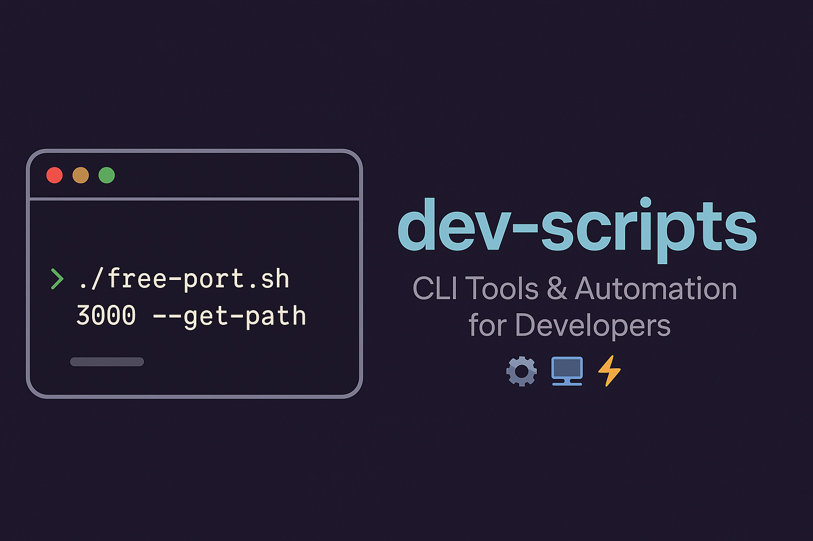

<p align="center">
  
  
  
</p>

# 🛠️ Dev Scripts Collection

A personal collection of lightweight and handy scripts for developers, sysadmins, and anyone who loves efficiency.  
Starting with `free-port.sh` — a simple yet powerful CLI tool to inspect and free up occupied ports on your system.

---

## 🚀 Script #1: free-port.sh

### What it does:
Easily check, inspect, and kill processes that are occupying a specific port.

- ✅ Show what process is using a port
- ✅ Display the full executable path (Node, Python, Docker, etc.)
- ✅ Confirm before killing the process (safe mode)
- ✅ Force kill mode (`--force`)
- ✅ Info-only mode (`--get-path`)
- ✅ List all active listening ports (`--list`)
- ✅ No external dependencies, just `bash` and `lsof`

---

### 📦 Installation

Clone this repository and make the script executable:

```bash
chmod +x free-port.sh
```

(Optional) Install globally for convenience:

```bash
sudo mv free-port.sh /usr/local/bin/free-port
```

Now you can use it anywhere:

```bash
free-port 3000
```

---

### ⚙️ Usage

#### Check port status (safe mode, will ask before killing):
```bash
./free-port.sh 3000
```

#### Force kill immediately:
```bash
./free-port.sh 3000 --force
```

#### Show process details and executable path (no action):
```bash
./free-port.sh 3000 --get-path
```

#### List all active ports:
```bash
./free-port.sh --list
```

---

### 🧩 Example output

```bash
$ ./free-port.sh 3000 --get-path

⚠️  Port 3000 is in use by:
COMMAND   PID USER   FD   TYPE             DEVICE SIZE/OFF NODE NAME
node    14615  ovi   17u  IPv6 0x79d166639bf87b0b      0t0  TCP *:3000 (LISTEN)
🧩 Executable path: /usr/local/bin/node
ℹ️  Info mode: no action taken.
```

---

### 📖 Options

| Option        | Description                                   |
|---------------|-----------------------------------------------|
| `<port>`      | Port number to inspect or free up             |
| `--force`     | Kill the process immediately (no confirmation) |
| `--list`      | List all active listening ports               |
| `--get-path`  | Show process details and executable path only |

---

### 🗂️ Roadmap

- [x] Add safe prompt mode
- [x] Add `--force` mode
- [x] Add full executable path resolution
- [x] Add `--get-path` inspection mode
- [x] Add `--list` mode to view active ports
- [ ] (Future) Tab-completion support
- [ ] (Future) More handy dev utilities (coming soon!)

---

### 🤝 Contributions

This is a personal tooling project, but if you have useful scripts to add to this collection, feel free to open a pull request!

---

### 📜 License

MIT — free to use, modify, and share.

---

### 🌟 Stay tuned

More handy developer scripts coming soon!  
Star ⭐ the repo to stay updated.
